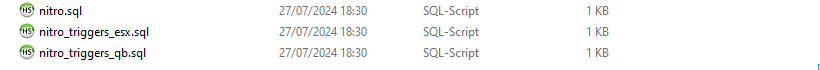

# 🚀 RHD Nitrous

### Intstallation:

1. Register nitrous items



1. Open `ox_inventory/data/items.lua` and enter the items below:

```lua
['empty_nitrous'] = {
    label = 'Nitrous (Empty)',
    weight = 500,
    client = {
        image = 'nitrous.png'
    }
},
['nitrous'] = {
    label = 'Nitrous (Original Colour)',
    weight = 1000,
    client = {
        image = 'nitrous.png'
    }
},
['red_nitrous'] = {
    label = 'Nitrous (Red Colour)',
    weight = 1000,
    client = {
        image = 'nitrous.png'
    }
},
['blue_nitrous'] = {
    label = 'Nitrous (Blue Colour)',
    weight = 1000,
    client = {
        image = 'nitrous.png'
    }
},
['purge_colour'] = {
    label = 'Purge Colour',
    weight = 100,
    client = {
        image = 'purge_colour.png'
    }
}
```

2. Then, open `rhd_nitrous/image` and copy all the images in it
3. Then, open `ox_inventory/web/images` and paste the copied image.



1. Open `qb-core/shared/items.lua` and enter the items below:

```lua
["empty_nitrous"] = {
    ["name"] = "empty_nitrous",
    ["label"] = "Nitrous (Empty)",
    ["weight"] = 500,
    ["type"] = "item",
    ["image"] = "nitrous.png",
    ["unique"] = true,
    ["useable"] = true,
    ["shouldClose"] = true,
    ["combinable"] = nil,
    ["created"] = nil,
    ["description"] = ""
},
["nitrous"] = {
    ["name"] = "nitrous",
    ["label"] = "Nitrous (Original Colour)",
    ["weight"] = 1000,
    ["type"] = "item",
    ["image"] = "nitrous.png",
    ["unique"] = true,
    ["useable"] = true,
    ["shouldClose"] = true,
    ["combinable"] = nil,
    ["created"] = nil,
    ["description"] = ""
},
["red_nitrous"] = {
    ["name"] = "red_nitrous",
    ["label"] = "Nitrous (Red Colour)",
    ["weight"] = 1000,
    ["type"] = "item",
    ["image"] = "nitrous.png",
    ["unique"] = true,
    ["useable"] = true,
    ["shouldClose"] = true,
    ["combinable"] = nil,
    ["created"] = nil,
    ["description"] = ""
},
["blue_nitrous"] = {
    ["name"] = "blue_nitrous",
    ["label"] = "Nitrous (Blue Colour)",
    ["weight"] = 1000,
    ["type"] = "item",
    ["image"] = "nitrous.png",
    ["unique"] = true,
    ["useable"] = true,
    ["shouldClose"] = true,
    ["combinable"] = nil,
    ["created"] = nil,
    ["description"] = ""
},
["purge_colour"] = {
    ["name"] = "purge_colour",
    ["label"] = "Purge Colour",
    ["weight"] = 1000,
    ["type"] = "item",
    ["image"] = "purge_colour.png",
    ["unique"] = true,
    ["useable"] = true,
    ["shouldClose"] = true,
    ["combinable"] = nil,
    ["created"] = nil,
    ["description"] = ""
},
```

2. Then, open `rhd_nitrous/image` and copy all the images in it
3. Then, open `qb-inventory/html/images` and paste the copied image.



1. Enter the nitrous item into your server database

```sql
INSERT INTO `items` (name, label, weight) VALUES
	('empty_nitrous','Nitrous (Empty)', 1),
	('nitrous','Nitrous (Original Colour)', 1),
	('red_nitrous','Nitrous (Red Colour)', 1),
	('blue_nitrous','Nitrous (Blue Colour)', 1),
	('purge_colour','Purge Colour', 1)
;
```



2. Run nitrous SQL on your database server

<figure><figcaption></figcaption></figure>

2. Then, start in `server.cfg` like the code below:

```lua
ensure ox_lib
ensure es_extended
ensure rhd_nitrous
```

### Dependencies:

* [ox\_lib](https://github.com/overextended/ox\_lib/releases)
* [ESX](https://github.com/esx-framework/esx\_core/tree/main/\[core]/es\_extended) or [QBCore](https://github.com/qbcore-framework/qb-core)
